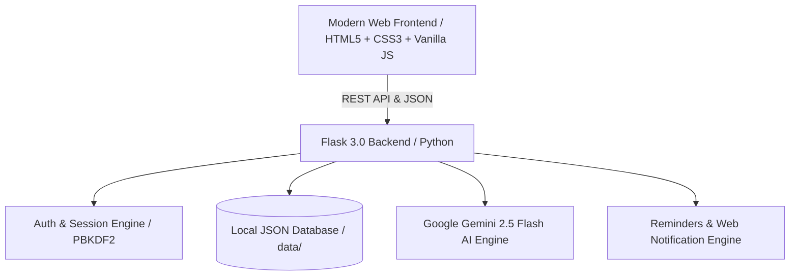

# <div align="center">Routines — Intelligent Personal Planner & AI Time Coach</div>

<div align="center">

[](https://python.org)
[](https://flask.palletsprojects.com/)
[](https://aistudio.google.com/)
[](LICENSE)
[](https://nessyhn.github.io/routines/)

*Plan your time with calmness, optimize your schedules, and manage your daily habits with Google Gemini AI.*

---

**[English](README.md)** • **[Türkçe](README.tr.md)**

---

[About](#about-the-project) • [Features](#key-features) • [Architecture](#architecture--tech-stack) • [Quick Start](#quick-start) • [GitHub Pages](#github-pages-live-site) • [Contributing](#contributing) • [License](#license)

</div>

---

## About the Project

**Routines** is an open-source, full-featured **smart personal planner and calendar web application** designed for modern individuals and professionals who seek focused, calm, and structured time management.

Unlike traditional bloated calendars, **Routines** integrates an intelligent **Google Gemini 2.5 Flash AI Engine** to analyze tight schedules, automatically resolve time overlaps, recommend mindful rest breaks, and deliver personalized astrological motivation tailored to your birth date.

---

## Key Features

### 1. Four Dynamic Calendar Views
- **Monthly View (Grid & Vertical Stream):** Overview of all days with dynamic color-coded category badges, national/world special days, and interactive mini-calendar sync.
- **Weekly View (Spacious Cards & Columns):** Full-width glassmorphic day cards, rapid one-click task scheduling, and real-time today indicator.
- **Daily Agenda (Hourly Slots):** 00:00 to 23:00 timeline blocks with instant clash detection and slot-specific plan creation.
- **Yearly Overview (12 Months):** Full 12-month event density matrix for long-term habit tracking.

### 2. Google Gemini AI Time Coach
- **Interactive AI Chat:** Discuss routines, time management strategies, productivity hacks, and habit systems in real-time.
- **Smart Day Optimization:** Analyzes busy days with a single click, injects restorative 10–15 minute breather breaks, and applies the optimized schedule directly to your calendar.

### 3. Unique Plan ID Architecture & Isolated Plan Management
- **Deterministic Unique ID System:** Every plan is assigned a unique identifier (`uuid`), preventing unintended batch deletions and allowing granular, isolated plan editing.
- **Lined Paper Sticky Note Memo:** A realistic lined notebook memo widget for daily goals and inspiring reflections (*"Bugün yeni başlangıçlar için harika bir gün ✨"*).

### 4. Multi-Channel Smart Reminder Engine
- **Flexible Timing:** Custom notifications 1 day, 5 hours, 1 hour, 30 minutes, or 15 minutes before events.
- **Web Audio & Push Alerts:** Cross-tab Web Notification API and clean audio alerts so you never miss a routine.

### 5. Personalized Astrological Inspiration
- Automatically calculates your astrological zodiac sign from your birth date upon registration.
- Delivers daily motivational horoscopes and time management reflections in a sleek sidebar widget.

### 6. Obsidian Glassmorphism & Soft Nordic Theme
- **Obsidian Dark:** Eye-friendly ultra-premium dark glass theme with deep radial background gradients and electric blue accents.
- **Soft Nordic Light:** Relaxing Scandinavian light mode with warm linen textures, soft charcoal typography, and delicate pastel accents.
- **Pure Vector SVG Icons:** Crystal-clear inline line icons with zero external icon font loading delay.

### 7. Private Local Database & PBKDF2 Security
- Secure password hashing with PBKDF2.
- Email verification code recovery flow.
- Standalone JSON database architecture (`data/` directory) with easy TXT export support.

---

## Architecture & Tech Stack



- **Backend:** Python 3.10+, Flask 3.0, Werkzeug
- **Artificial Intelligence:** Google GenAI SDK (`google-genai`), Gemini 2.5 Flash
- **Frontend:** Semantic HTML5, CSS3 Custom Properties, Vanilla JavaScript (Modular ES6+)
- **Graphics & Assets:** Inline Vector SVG, FontAwesome 6, Pillow
- **Storage:** File-based lightweight and secure JSON architecture

---

## Quick Start

### 1. Clone the Repository
```bash
git clone https://github.com/nessyhn/routines.git
cd routines
```

### 2. Set Up Python Virtual Environment
```bash
# Windows
python -m venv .venv
.venv\Scripts\activate

# macOS / Linux
python3 -m venv .venv
source .venv/bin/activate
```

### 3. Install Dependencies
```bash
pip install -r requirements.txt
```

### 4. Configure Environment Variables
Copy `.env.example` to `.env` and insert your free Gemini API key from [Google AI Studio](https://aistudio.google.com/):
```bash
cp .env.example .env
```
`.env` contents:
```ini
GEMINI_API_KEY=your_gemini_api_key_here
```

### 5. Run the Application
```bash
python app.py
```
Open your browser at **`http://127.0.0.1:5000`**

---

## GitHub Pages Live Site

Explore the live interactive showcase page hosted on GitHub Pages:  
👉 **[https://nessyhn.github.io/routines/](https://nessyhn.github.io/routines/)**

---

## Project Directory Tree

```
routines/
├── app.py                  # Flask web server & REST API endpoints
├── models.py               # User, Plan, Zodiac & Data Models
├── ai_engine.py            # Google Gemini 2.5 Flash AI Integration
├── person.py               # Core Person entity model
├── requirements.txt        # Python package dependencies
├── .env.example            # Environment variables template
├── .gitignore              # Privacy & bytecode exclusions
├── LICENSE                 # MIT Open Source License
├── README.md               # English Documentation
├── README.tr.md            # Türkçe Dökümantasyon
├── docs/                   # GitHub Pages Showcase Website
│   └── index.html
├── static/
│   ├── css/
│   │   ├── style.css       # Core styles, themes & glassmorphism
│   │   └── calendar.css    # Calendar cards, agenda & grid styling
│   ├── js/
│   │   ├── app.js          # Core app, theme toggles & toasts
│   │   ├── auth.js         # Authentication & session management
│   │   ├── calendar.js     # Calendar engine & 4-view renderer
│   │   ├── ai_assistant.js # AI coach chat & day optimizer
│   │   └── reminders.js    # Notification & background audio engine
│   └── img/
│       ├── favicon.svg     # Clean 'r.' vector brand icon
│       ├── favicon.ico     # Multi-resolution browser icon
│       ├── og-preview.png  # Social media preview banner (EN)
│       └── og-preview-tr.png # Social media preview banner (TR)
└── templates/
    ├── index.html          # Main web application template
    ├── 404.html            # Custom Obsidian-themed 404 page
    └── astrology.html      # Astrological insights modal
```

---

## Contributing

Contributions, issues, and feature requests are welcome! Feel free to check the [CONTRIBUTING.md](CONTRIBUTING.md) guide.

1. Fork the Project (`Fork`)
2. Create your Feature Branch (`git checkout -b feature/AmazingFeature`)
3. Commit your Changes (`git commit -m 'feat: Add some AmazingFeature'`)
4. Push to the Branch (`git push origin feature/AmazingFeature`)
5. Open a **Pull Request**

---

## License

Distributed under the [MIT License](LICENSE). Copyright © 2026 Nesibe Nur Seyhan.
