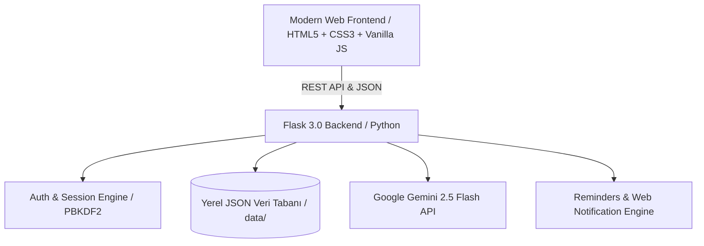

# <div align="center">Routines — Akıllı Kişisel Ajanda & AI Zaman Koçu</div>

<div align="center">

[](https://python.org)
[](https://flask.palletsprojects.com/)
[](https://aistudio.google.com/)
[](LICENSE)
[](https://nessyhn.github.io/routines/)

*Zamanınızı sakinlikle planlayın, rutinlerinizi ve hedeflerinizi Google Gemini AI zaman koçu ile yönetin.*

---

**[English](README.md)** • **[Türkçe](README.tr.md)**

---

[Proje Hakkında](#proje-hakkında) • [Özellikler](#temel-özellikler) • [Mimari & Teknoloji](#mimari--teknoloji-yığını) • [Hızlı Kurulum](#hızlı-kurulum) • [GitHub Pages](#github-pages-canlı-sitesi) • [Katkıda Bulunma](#katkıda-bulunma) • [Lisans](#lisans)

</div>

---

## Proje Hakkında

**Routines**, modern bireylerin ve profesyonellerin günlük, haftalık ve aylık zamanlarını karmaşadan uzak, odaklı ve dingin bir biçimde yönetmeleri için tasarlanmış açık kaynaklı, tam teşekküllü bir **akıllı ajanda ve takvim web uygulamasıdır**.

Geleneksel hantal takvimlerin aksine, **Routines** arka planda çalışan **Google Gemini 2.5 Flash Yapay Zeka Motoru** ile gününüzdeki çakışan planları otomatik olarak çözer, verimlilik aralıkları önerir, sesli & çok kanallı bildirimler üretir ve doğum tarihinize özel astrolojik motivasyon koçluğu sunar.

---

## Temel Özellikler

### 1. Dört Farklı Akıllı Takvim Görünümü
- **Aylık Görünüm (Izgara & Dikey Akış):** Ayın tüm günlerini etkinlik göstergeleri, kategori rozetleri ve dinamik mini takvim senkronizasyonu ile sunar.
- **Haftalık Görünüm (Geniş Kartlar & Sütunlar):** 7 günü boydan boya kaplayan ferah cam kartlar, hızlı tek tıkla plan ekleme ve bugün vurgusu.
- **Günlük Ajanda (Saatlik Dilimler):** 00:00 - 23:00 arası saatlik bloklar, çakışma tespiti ve tek tıkla doğrudan o saate plan oluşturma.
- **Yıllık Genel Bakış (12 Ay):** Tüm yılın etkinlik yoğunluğunu tek ekranda gösteren mini takvim matrisi.

### 2. Google Gemini Destekli AI Zaman Koçu
- **Canlı AI Sohbeti:** Rutinleriniz, hedefleriniz, alışkanlık takip yöntemleri ve zaman yönetimi stratejileri üzerine anlık konuşun.
- **Akıllı Gün Optimizasyonu:** Yoğun günlerde tek tıkla tüm planlarınızı analiz eder, aralara 10-15 dakikalık dinlenme molaları serpiştirir ve optimize edilmiş yeni programı anında takviminize işler.

### 3. Benzersiz Plan ID Mimarisi & İzole Plan Yönetimi
- **Tekil ID Sistemi:** Her plana otomatik benzersiz bir kimlik (`id`) atanır; aynı isimdeki planların yanlışlıkla birlikte silinmesi engellenir ve her plan bağımsız olarak yönetilir.
- **Günün Özeti Çizgili Not Defteri:** Günün önemli hedeflerini ve ilham verici düşüncelerini (*"Bugün yeni başlangıçlar için harika bir gün ✨"*) kaydedebileceğiniz gerçekçi defter yaprağı widget'ı.

### 4. Çok Kanallı Akıllı Hatırlatıcı Motoru
- **Çoklu Zaman Dilimi:** Plan saatinden 1 gün, 5 saat, 1 saat, 30 dakika, 15 dakika önce veya özel tanımlı bildirimler.
- **Sesli Alarm & Web Bildirimleri:** Tarayıcı açıkken sekmeler arası çalışan Web Notification API ve Web Audio sentezleyici.

### 5. Kişisel Burç İlhamı & Motivasyon
- Kayıt olurken girilen doğum tarihinden burcunuzu anında hesaplar.
- Günün burç yorumunu ve zaman yönetimi tüyolarını kenar menüsünde özel akordeon kutusunda sunar.

### 6. Obsidian Glassmorphism & Soft Nordic Tema
- **Obsidian Dark:** Göz yormayan ultra lüks koyu cam efekti, radyal arka plan gradyanı ve neon mavi vurgular.
- **Soft Nordic Light:** Sıcak keten dokuları, yumuşak kömür tipografisi ve dinlendirici pastel tonlarıyla yenilenmiş açık İskandinav teması.
- **Saf Vektörel SVG Çizgi İkonlar:** Harici font beklemeden her ortamda anında ve kristal netliğinde çizilen ikonlar.

### 7. Güvenli Yerel Veri Tabanı & Kimlik Doğrulama
- PBKDF2 hashleme ile güvenli şifreleme.
- E-posta doğrulama kodlu "Şifremi Unuttum" akışı.
- TXT / Veri yedekleme ve dışa aktarma (Export) desteği.

---

## Mimari & Teknoloji Yığını



- **Backend:** Python 3.10+, Flask 3.0, Werkzeug
- **Yapay Zeka:** Google GenAI SDK (`google-genai`), Gemini 2.5 Flash
- **Frontend:** Modern Semantic HTML5, CSS3 Custom Properties, Vanilla JavaScript (ES6+ Modüler Mimari)
- **Vektörel Çizim & Medya:** Pure Inline SVG, FontAwesome 6, Pillow
- **Depolama:** Dosya tabanlı güvenli JSON mimarisi (`data/` dizini)

---

## Hızlı Kurulum

### 1. Depoyu Klonlayın
```bash
git clone https://github.com/nessyhn/routines.git
cd routines
```

### 2. Python Sanal Ortamını Hazırlayın
```bash
# Windows
python -m venv .venv
.venv\Scripts\activate

# macOS / Linux
python3 -m venv .venv
source .venv/bin/activate
```

### 3. Bağımlılıkları Yükleyin
```bash
pip install -r requirements.txt
```

### 4. Ortam Değişkenlerini Ayarlayın
`.env.example` dosyasını `.env` olarak kopyalayın ve [Google AI Studio](https://aistudio.google.com/)'dan aldığınız ücretsiz Gemini API anahtarınızı ekleyin:
```bash
cp .env.example .env
```
`.env` içeriği:
```ini
GEMINI_API_KEY=your_gemini_api_key_here
```

### 5. Uygulamayı Başlatın
```bash
python app.py
```
Tarayıcınızda açın: **`http://127.0.0.1:5000`**

---

## GitHub Pages Canlı Sitesi

Projenin canlı tanıtım ve dökümantasyon sayfası:  
👉 **[https://nessyhn.github.io/routines/](https://nessyhn.github.io/routines/)**

---

## Proje Dosya Ağacı

```
routines/
├── app.py                  # Flask ana web sunucusu ve API rotaları
├── models.py               # Kullanıcı, plan, burç ve veri modelleri
├── ai_engine.py            # Google Gemini 2.5 Flash AI entegrasyon motoru
├── person.py               # Çekirdek Kullanıcı varlık modeli
├── requirements.txt        # Python bağımlılıkları
├── .env.example            # Örnek ortam değişkenleri şablonu
├── .gitignore              # Gizlilik ve önbellek filtreleri
├── LICENSE                 # MIT Açık Kaynak Lisansı
├── README.md               # İngilizce Dökümantasyon
├── README.tr.md            # Türkçe Dökümantasyon
├── docs/                   # GitHub Pages tanıtım sayfası
│   └── index.html
├── static/
│   ├── css/
│   │   ├── style.css       # Temel stiller, temalar, animasyonlar
│   │   └── calendar.css    # Takvim görünümleri, kartlar, cam efektleri
│   ├── js/
│   │   ├── app.js          # Çekirdek uygulama, toast bildirimleri, temalar
│   │   ├── auth.js         # Kimlik doğrulama ve kullanıcı oturumu
│   │   ├── calendar.js     # Takvim motoru, navigasyon, 4 görünüm
│   │   ├── ai_assistant.js # AI asistan sohbeti ve optimizasyon
│   │   └── reminders.js    # Arka plan hatırlatıcı & bildirim servisi
│   └── img/
│       ├── favicon.svg     # Kutusuz saf 'r.' vektörel favicon
│       ├── favicon.ico     # Çok çözünürlüklü tarayıcı ikonu
│       ├── og-preview.png  # Sosyal medya paylaşım kartı (EN)
│       └── og-preview-tr.png # Sosyal medya paylaşım kartı (TR)
└── templates/
    ├── index.html          # Ana uygulama şablonu
    ├── 404.html            # Obsidian temalı özel 404 hata sayfası
    └── astrology.html      # Astroloji & motivasyon modalı
```

---

## Katkıda Bulunma

Katkılarınızı memnuniyetle kabul ediyoruz! Lütfen katkıda bulunmadan önce [CONTRIBUTING.md](CONTRIBUTING.md) dosyasını inceleyin.

1. Depoyu Fork'layın (`Fork`)
2. Yeni Dal Açın (`git checkout -b feature/YeniOzellik`)
3. Değişikliklerinizi Commit Edin (`git commit -m 'feat: Yeni özellik eklendi'`)
4. Dalınıza Push Yapın (`git push origin feature/YeniOzellik`)
5. Bir **Pull Request** Oluşturun

---

## Lisans

Bu proje [MIT Lisansı](LICENSE) altında açık kaynaklı olarak sunulmaktadır. Copyright © 2026 Nesibe Nur Seyhan.
